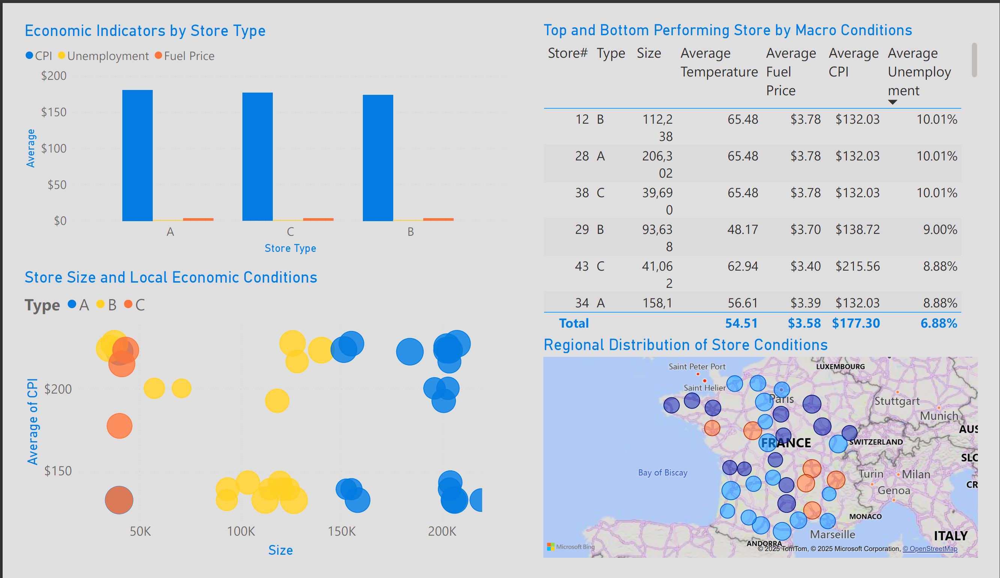

# 🛒 Walmart Sales Forecast & Economic Trends Dashboard

This Power BI project analyzes **Walmart’s weekly operational data** (Features dataset from Kaggle) to explore relationships between **economic indicators, promotional markdowns, and holiday activity** across stores in the U.S.  

The dashboard highlights how external factors such as inflation (CPI), unemployment, and fuel price correlate with Walmart’s internal promotional intensity.

---

## 📂 Dataset
**Source:** [Walmart Recruiting – Store Sales Forecasting (Kaggle)](https://www.kaggle.com/c/walmart-recruiting-store-sales-forecasting)

**Files Used**
- `features.csv` – weekly economic and store-level data  
- `stores.csv` – store type and size metadata  

**Data Modeling**
- Merged by `Store` + `WeekEnd (Friday)`  
- Focused on the `Features` table for analysis  
- Columns used: Temperature, Fuel_Price, CPI, Unemployment, IsHoliday, MarkDown1–5, Store Type, Size  

---

## 📊 Dashboard Pages

### **Page 1 – Overview**
**Goal:** Summarize national economic and operational trends  
**Key Visuals**
- Weekly trends of Temperature, Fuel Price, CPI, and Unemployment (average per store)  
- Holiday week distribution per year  
- Store-type comparison of economic conditions  
- KPI cards for averages and holiday-week percentage  

---

### **Page 2 – Regional Insights**
**Goal:** Compare store types and regions  
**Key Visuals**
- Map of average conditions by store  
- Scatter plot: Store Size vs Average CPI 
- Store ranking table by key metrics  
- Type-level comparison of macro indicators  

---

### **Page 3 – Trends & Correlations**
**Goal:** Explore relationships and future projections  
**Key Visuals**
- 12-week forecast of Fuel Price trend  
- CPI vs Markdown scatter plot with trendline  
- Correlation KPI (`Corr CPI_MarkDown`) showing Pearson’s r value  
- Temperature seasonality and holiday impact comparison  

---

### **Page 4 – Insights & Recommendations**
**Goal:** Interpret results and provide data-driven takeaways  
**Key Insights**
1. **Inflation & Promotions**  
   - CPI shows a steady upward trend across the observed period, mirroring real-world inflation.  
   - The correlation between CPI and Markdown activity (r ≈ *negative value from your KPI*) suggests **fewer discounts during high inflation**, possibly due to cost pressures.

2. **Holiday Effects**  
   - Holiday weeks make up about **8%** of all periods but coincide with **sharp increases in markdown intensity**.  
   - Indicates Walmart leverages markdowns heavily to boost holiday sales, aligning with retail best practices.

3. **Fuel & Consumer Conditions**  
   - Fuel prices and CPI rise in tandem, reinforcing external cost challenges during 2011–2012.  
   - Unemployment fluctuations appear disconnected from markdown behavior, implying local labor conditions weren’t a dominant sales driver.

4. **Regional Patterns**  
   - **Type A (large)** stores typically exist in higher-CPI regions with lower unemployment rates, possibly representing wealthier markets.  
   - **Type B/C** stores show more volatility in markdowns, implying more aggressive price competition in smaller or lower-income areas.

**Recommendations**
- **Pricing Strategy:** During inflationary periods, consider maintaining promotional cadence rather than reducing markdowns to protect customer perception.  
- **Holiday Planning:** Continue leveraging markdowns in the 8% of holiday weeks—historically the strongest promotional windows.  
- **Data Refinement:** Improve feature coverage across all stores (e.g., Store 28 anomalies) for more consistent forecasting.  
- **Future Work:** Integrate the `train` dataset back for direct sales correlation to validate the impact of markdowns and CPI.

---

## 🧰 Tools & Techniques
- **Power BI Desktop**
  - DAX measures for KPIs, moving averages, and Pearson correlation  
  - Conditional formatting for KPI indicators  
  - Forecasting via Analytics Pane  
- **Data Cleaning:** Power Query (type alignment, week-end normalization, blank handling)
- **Color Theme:** Walmart Blue `#0071CE` and Yellow `#FFC220`  

---

## 📁 Files in Repository
| File | Description |
|------|--------------|
| `walmart-dashboard.pbix` | Power BI project file |
| `walmart-dashboard.pdf` | Exported dashboard for viewing |
| `screenshots/` | Page screenshots for README preview |
| `README.md` | This document |

---

## 📈 Preview

---

## 🧾 Author
**Javier Pastor**  
*Data Analyst | Power BI, SQL, Python, Excel*  
[LinkedIn Profile](https://www.linkedin.com/) *https://www.linkedin.com/in/javier-pastor-a324b0384/*

---

### 🗂️ Project Summary
This project demonstrates:
- Strong data modeling & DAX logic  
- Ability to connect economic factors to operational behavior  
- Dashboard design focused on clarity, storytelling, and actionable business insights  

---

*Data Source: Walmart Recruiting – Store Sales Forecasting (Kaggle)*
